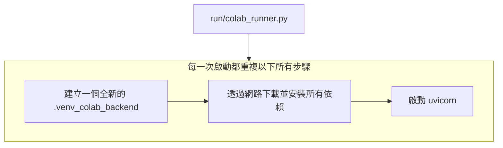
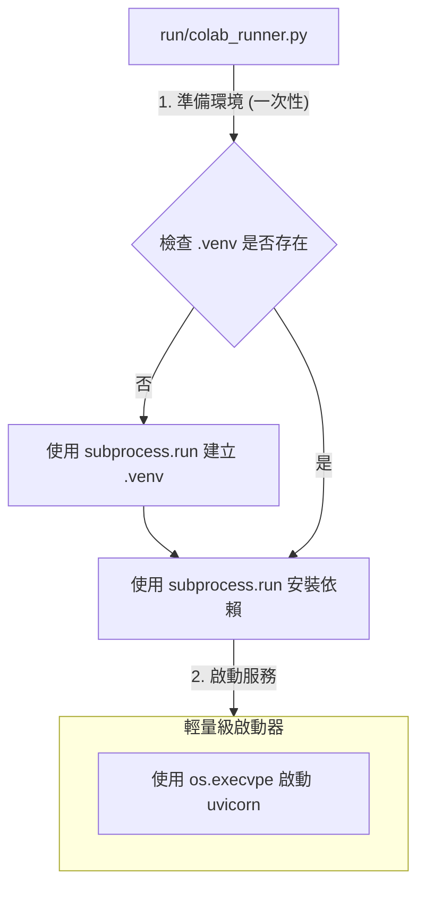

# BUG.MD：受限沙箱環境下 Python 應用啟動失敗問題的深度分析與架構優化報告

本文檔旨在深入復盤一次由應用程式啟動失敗引發的、涵蓋了環境除錯、架構重構與防禦性設計的完整技術實踐。

## 1. 問題概述 (Problem Overview)

*   **現象 (Symptom)**：在 Colab 環境中執行 `run/colab_runner.py` 時，應用程式啟動流程極度緩慢，輸出海量的依賴安裝日誌，最終以後端服務返回一個不明確的 `錯誤碼 1` 而失敗告終。
*   **影響 (Impact)**：核心應用程式在目標環境下完全無法穩定運行，使得所有上層功能開發與測試被阻塞。

## 2. 根本原因分析 (Root Cause Analysis)

我們透過分析發現，問題出在兩個層面：一是應用的設計缺陷，二是執行環境的隱藏 BUG。

### 2.1. 直接原因：啟動流程設計缺陷

最初的架構中，`run/colab_runner.py`（A 腳本）會呼叫 `scripts/start_api_service.py`（B 腳本）來啟動後端。問題在於，B 腳本被設計成一個「自給自足」但「沒有記憶」的腳本。

**這意味著，每一次 A 呼叫 B，B 都會從頭開始執行一套完整的、重量級的環境準備流程。**


這個設計直接導致了啟動緩慢和因網路波動等原因造成的不穩定。

### 2.2. 深層原因：沙箱環境的隱藏 BUG

在嘗試修復上述問題的過程中，我們遭遇了一個更深層、更詭異的環境 BUG。

*   **關鍵發現**：在此沙箱環境中，任何被呼叫的 Python 函式，如果其程式碼的**定義**中包含了 `subprocess.Popen` 這個指令，就會導致 Python 解譯器在執行到該函式呼叫時，**立即無聲地掛起 (Silent Hang)**。

*   **致命之處**：這個掛起發生在函式內任何程式碼被實際執行之前，且不會產生任何錯誤或日誌。即使 `Popen` 指令位於一個永遠為假的 `if` 區塊內，BUG 依舊會被觸發。

*   **舉例 (Minimal Reproducible Example)**：
    ```python
    import subprocess

    # 這個函式會導致解譯器在被呼叫時無聲地掛起
    def a_function_that_hangs():
        # 即使這行程式碼永遠不會被執行，它的「存在」本身就足以觸發 BUG
        if False:
            subprocess.Popen(["ls"])
        print("This line is never reached.")

    print("About to call the function...")
    # 程式會在此處掛起，下一行 "Function call finished." 永遠不會被打印
    a_function_that_hangs()
    print("Function call finished.")
    ```

*   **結論**：這強烈暗示我們所處的並非一個標準的 Linux 環境，而是存在一個**有缺陷的「系統呼叫攔截層」**（如 gVisor）。它在處理 Python 創建新程序 (`fork` -> `exec`) 的特定系統呼叫組合時存在問題，導致了解譯器本身的死鎖或崩潰。

## 3. 解決方案與重構後的架構

為了解決上述兩個問題，我們圍繞「**職責分離**」和「**規避環境 BUG**」這兩個中心思想，設計了全新的啟動架構。

### 3.1. 設計原則

1.  **職責分離**：將「環境準備」和「應用啟動」徹底分開。
2.  **包裝器模式 (Wrapper Pattern)**：使用一個上層腳本作為「包裝器」或「編排者」，專職負責環境準備。
3.  **同步阻塞的環境準備**：為了穩定性，環境準備工作應採用簡單、線性的同步阻塞模型。
4.  **非同步併發的應用執行**：主應用程式本身則可以繼續享受 `asyncio` 帶來的高效 I/O 併發。

### 3.2. 新架構圖



### 3.3. 關鍵程式碼變更

1.  **`run/colab_runner.py`**：被改造為「編排者」，加入了檢查、建立、安裝虛擬環境的邏輯（使用 `subprocess.run` 以規避 BUG），並確保總是使用 `.venv/bin/python` 來啟動後端。
2.  **`scripts/start_api_service.py`**：被極度簡化為「輕量啟動器」，移除了所有環境操作，只保留用 `os.execvpe` 啟動 uvicorn 的核心功能。

## 4. 防禦性設計與健壯性策略

除了核心的架構修復，我們還討論了數個可以進一步提升系統健壯性的策略。

### 4.1. 看門狗監控 (Watchdog Monitoring)

對於需要長時間運行的背景服務，應實施「看門狗」機制來監控其健康狀況。

*   **策略**：主監控程序（例如 `run/colab_runner.py`）在啟動背景服務後，啟動一個定時器。背景服務需要定期地輸出日誌來「餵狗」(reset the watchdog)。如果定時器在指定時間內（例如 10 秒）沒有被重置，就意味著背景服務可能已經卡死或無回應，此時應自動終止並重啟該服務。

*   **核心程式碼邏輯**：
    ```python
    import threading

    watchdog_timer = None
    server_process = None # Popen object

    def handle_timeout():
        print("❌ 看門狗觸發！後端服務無回應，正在終止...")
        if server_process:
            server_process.kill()
        # 在此處可以加入重啟邏輯

    def reset_watchdog(timeout=10.0):
        global watchdog_timer
        if watchdog_timer:
            watchdog_timer.cancel()
        watchdog_timer = threading.Timer(timeout, handle_timeout)
        watchdog_timer.start()

    # 在主程序中
    # reset_watchdog() # 啟動看門狗
    # for line in server_process.stdout:
    #     print(line)
    #     reset_watchdog() # 每次收到日誌就重置計時器
    ```

### 4.2. 下載檔案隔離

*   **策略**：應用程式在運行過程中產生或下載的所有檔案（例如用戶上傳的內容、數據分析結果等），都必須儲存到一個與應用程式原始碼完全隔離的指定目錄（例如 `/content/downloads` 或 `project_path / "downloads"`）。
*   **實作**：應透過 `config.json` 中的一個明確配置項來定義這個下載路徑，主應用程式從設定檔中讀取此路徑，而不是在程式碼中硬編碼。這可以有效防止用戶產生的內容意外地污染或破壞應用程式的運行環境。

### 4.3. 擁抱現代化工具鏈

*   **建議**：在類似的受限環境中，應優先考慮使用 **Poetry** 或 **uv**。這些現代化的依賴管理工具，能將複雜的環境設定步驟封裝成單一、可靠、原子性的指令（例如 `poetry install` 或 `uv pip sync`），極大簡化包裝器腳本的邏輯，從而顯著降低觸發環境 BUG 的機率。

### 4.4. 多核 CPU 利用與生產/消費者模式

為了在生產環境中充分發揮多核 CPU 的性能，應採用標準的**多進程平行**架構。

*   **架構**：使用 Gunicorn 作為「程序管理器」（生產者），啟動多個 Uvicorn Worker（消費者）來平行處理請求。
*   **模型**：這是一個典型的「生產者-消費者」模式，能完美結合 Gunicorn 的多進程平行優勢和 Uvicorn/FastAPI 的非同步併發優勢。

```mermaid
graph TD
    subgraph Internet
        R[HTTP 請求]
    end

    subgraph "單一伺服器 (多核心)"
        M[Gunicorn 主程序<br>(總經理/生產者)]
        subgraph "Worker Processes (平行)"
            W1[Worker 1<br>(Uvicorn/FastAPI<br>非同步)]
            W2[Worker 2<br>(Uvicorn/FastAPI<br>非同步)]
            W3[Worker 3<br>(Uvicorn/FastAPI<br>非同步)]
            W4[Worker 4<br>(Uvicorn/FastAPI<br>非同步)]
        end
    end

    R --> M;
    M -- 分發任務 --> W1;
    M -- 分發任務 --> W2;
    M -- 分發任務 --> W3;
    M -- 分發任務 --> W4;
```

## 5. 結論

這次的任務始於一個看似簡單的啟動失敗 BUG，但最終演變成一場對底層環境、進程管理、軟體架構的深度探索。它深刻地揭示了，在現代複雜的雲端與沙箱環境中，**簡單、可預測、職責單一的設計原則，遠比追求單一腳本的功能強大更為重要和健壯**。透過採用分層的、職責分離的架構，並輔以現代化的工具鏈，我們才能構建出能夠抵禦未知環境風險的、真正可靠的應用程式。

---

### **附錄：鳳凰之心協定 - 實戰案例與除錯流程**

本章節記錄了在「鳳凰之心 - 第三階段」計畫中，我們如何應用本文檔提出的核心原則，成功地從一次由底層環境 BUG 引發的重大失敗中恢復，並完成了一次健壯的系統重構。此案例旨在為未來的開發與除錯工作，提供一套可複製、可執行的標準作業程序 (SOP)。

#### **情境回顧：一個「無聲掛起」的挑戰**

我們當時面臨的挑戰是，在一個受限的沙箱環境中，主運行腳本 (`run/colab_runner.py`) 無法穩定運行。它會無預警地「超時」或「掛起」，並且由於日誌緩衝機制，我們無法獲得任何有效的即時反饋，陷入了「資訊黑洞」。

#### **解決方案：應用「鳳凰之心」五大原則的實戰流程**

我們沒有直接修復主腳本，而是啟動了「安全重構協定」，將複雜問題分解為一系列可控、可驗證的小步驟。

**1. 建立「安全測試沙箱」 (對應：環境隔離原則)**

*   **問題**：每次都用重量級腳本 (`local_run.py`) 重新建立環境，不僅耗時，更容易觸發沙箱的底層 BUG。
*   **SOP**：
    1.  **一次性建立環境**：在專案根目錄下，執行 `.venv/bin/python -m venv .venv` 建立一個持久化的虛擬環境。
    2.  **安裝核心依賴**：執行 `.venv/bin/pip install -r requirements/base.txt` 安裝最基礎的依賴。
    3.  **打造輕量級啟動器**：建立一個只負責啟動後端服務的 `scripts/run_server_only.py` 腳本。
*   **成果**：我們獲得了一個可在 10 秒內快速啟動、行為可預測的後端，為後續所有快速驗證奠定了基石。

**2. 建立「看門狗探測器」 (對應：隔離驗證原則)**

*   **問題**：直接修改主腳本，無法判斷問題是出在「新邏輯」還是「舊框架」。
*   **SOP**：
    1.  **建立臨時驗證腳本**：建立一個一次性的 `tools/db_watchdog_probe.py`。
    2.  **實現最小化邏輯**：在此腳本中，只實現最核心的監控邏輯（主動健康檢查 + 被動心跳監控）。
    3.  **進行「雙終端機」整合測試**：
        *   **終端機 A**：在背景運行輕量級後端 (`run_server_only.py`)。
        *   **終端機 B**：在前台運行探測器 (`db_watchdog_probe.py`)。
    4.  **模擬故障**：在終端機 A 中手動 `Ctrl+C` 停止後端，觀察終端機 B 是否能按預期檢測到失敗並自動退出。
*   **成果**：我們在一個完全隔離的環境中，100% 驗證了監控邏輯的可靠性。這次驗證是整個重構成功的轉捩點。

**3. 強化「可觀測性」與「除錯流程」**

*   **問題**：日誌緩衝導致無法即時判斷程式狀態。
*   **SOP**：
    1.  **強制無緩衝輸出**：所有 Python 驗證指令前，必須加上 `PYTHONUNBUFFERED=1` 環境變數。
        *   **範例**: `PYTHONUNBUFFERED=1 .venv/bin/python tools/db_watchdog_probe.py`
    2.  **除錯資料庫**：當需要檢查 SQLite 資料庫 (`state.db`) 內容，但 `sqlite3` 指令不存在時，可使用 Python 一行指令進行查詢。
        *   **查所有表名**:
            ```bash
            .venv/bin/python -c "import sqlite3; con = sqlite3.connect('state.db'); cur = con.cursor(); cur.execute(\"SELECT name FROM sqlite_master WHERE type='table';\"); print(cur.fetchall())"
            ```
    3.  **除錯埠號佔用**：當懷疑有「殭屍進程」佔用埠號（例如 8088）時，使用 `lsof` 和 `kill` 清理。
        *   **範例**: `kill $(lsof -t -i:8088) || echo "埠號乾淨"`

**4. 安全移植已驗證的邏輯**

*   **問題**：如何確保新邏輯在整合進主應用後，不會產生新的問題？
*   **SOP**：
    1.  將 `db_watchdog_probe.py` 中已被完整驗證過的程式碼，完整地複製並覆寫到 `run/colab_runner.py` 的主迴圈中。
    2.  **重複執行完全相同的整合測試**，但這次的目標是 `run/colab_runner.py`，確保其行為與探測器完全一致。
*   **成果**：我們移植的不再是「程式碼」，而是一個已通過嚴格品管的「成品」，確保了最終整合的成功。
