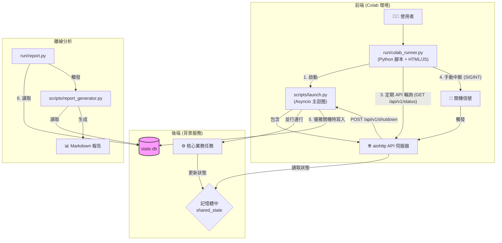

# 鳳凰之心 V24：API 驅動架構藍圖

這份文件是一份權威性的技術藍圖，旨在精準反映專案 V24 的最終形態。它闡述了專案如何從過去的資料庫輪詢模式，演進為一個更現代、更穩健、更具擴展性的 API 驅動架構。

---

## 一、 核心設計哲學：前端與後端的徹底解耦

V24 架構的核心是**「關注點分離 (Separation of Concerns)」**。我們將使用者介面（前端）與核心業務邏輯（後端）徹底分離，兩者之間透過一組定義清晰的 API 進行非同步通訊。

-   **前端 (`run/colab_runner.py`)**: 作為一個純粹的「顯示層」，它的唯一職責是啟動後端服務，並透過 API 定期輪詢狀態，然後將這些狀態渲染成使用者可見的儀表板。它不關心後端是如何實現其業務邏輯的。
-   **後端 (`scripts/launch.py`)**: 作為一個常駐的「服務層」，它封裝了所有的核心業務邏輯、資源監控和狀態管理。它透過一個輕量級的 API 端點向外界暴露其狀態，但並不關心是誰在使用這些 API，也不關心前端是如何展示它們的。

這種架構帶來了極大的優勢：
1.  **穩定性**: 前端的任何錯誤（例如 Colab 的 UI 渲染問題）完全不會影響後端核心任務的執行。
2.  **可擴展性**: 未來我們可以輕易地為這個後端服務開發新的前端（例如一個本地的 PyQt/Tkinter 應用，或是一個 Web App），而無需改動任何後端程式碼。
3.  **可測試性**: 前後端可以被獨立測試。我們可以針對後端的 API 編寫整合測試，也可以獨立測試前端的 UI 邏輯（如果需要）。

---

## 二、 V24 核心技術棧 (Tech Stack)

| 技術 | 用途 | 在專案中的位置 |
| :--- | :--- | :--- |
| **`Aiohttp`** | **後端 Web 框架**：提供高效能的非同步 HTTP 伺服器，處理 API 請求。 | `scripts/launch.py` |
| **`Asyncio`** | **非同步程式設計**：作為後端服務的基石，讓網路服務與背景任務並行運行。 | `scripts/launch.py` |
| **`Python in Colab`** | **前端介面**：利用 IPython 的能力渲染動態 HTML 儀表板。 | `run/colab_runner.py` |
| **`HTML/CSS/JS`** | **儀表板渲染**：前端使用標準 `fetch` API 輪詢後端，動態更新頁面。 | `run/colab_runner.py` |
| **`SQLite`** | **資料持久化**：作為唯一的「真相來源」，儲存任務結束後的最終狀態。 | `state.db`, `scripts/launch.py` |
| **`Pandas`** | **數據分析**：用於在報告生成時，方便地從資料庫讀取和處理數據。 | `scripts/report_generator.py` |
| **`Tabulate`** | **報告格式化**：將 Pandas DataFrame 轉換為精美的 Markdown 表格。 | `scripts/report_generator.py` |
| **`Pytest`** | **自動化測試**：作為核心測試框架。 | `tests/` |
| **`pytest-aiohttp`** | **API 測試插件**：專門用於在 Pytest 中測試 Aiohttp 應用。 | `tests/integration/` |

---

## 三、 V24 架構圖

---

## 四、 核心組件職責詳解

*   **`run/colab_runner.py` (指揮中心)**
    *   **職責**: 作為使用者互動的**唯一入口**。
    *   **流程**:
        1.  讀取 Colab 表單參數（例如日誌等級）。
        2.  根據參數生成一個 `config.json` 設定檔。
        3.  下載或使用本地的程式碼。
        4.  安裝 `requirements.txt` 中的依賴。
        5.  以子進程方式，帶著 `--config` 參數啟動後端服務 `scripts/launch.py`。
        6.  渲染一個包含 JavaScript 的 HTML 儀表板，該儀表板會持續輪詢後端的 API 來顯示狀態。
        7.  捕獲使用者的 `Ctrl+C` (KeyboardInterrupt) 中斷信號，並向後端發送優雅關機的 API 請求。

*   **`scripts/launch.py` (後端 API 服務)**
    *   **職責**: **常駐的背景服務**，執行所有核心工作並透過 API 提供狀態。
    *   **流程**:
        1.  啟動時，解析 `--config` 參數，並設定日誌等級。
        2.  初始化 `aiohttp` 應用和 API 端點 (`/api/v1/status`, `/api/v1/shutdown`)。
        3.  在 `asyncio` 事件迴圈中，並行啟動核心業務邏輯 (`core_task`) 和資源監控等背景任務。
        4.  所有狀態（目前階段、CPU/RAM 使用率、日誌等）都即時更新到一個記憶體中的 `shared_state` 字典裡。
        5.  `/api/v1/status` 端點被呼叫時，直接從 `shared_state` 讀取數據並返回 JSON。
        6.  當接收到關機信號（來自 API 或任務自然結束）時，執行優雅關機程序：停止 API 伺服器、取消背景任務，並將 `shared_state` 中的最終狀態持久化寫入 `state.db`。

*   **`run/report.py` & `scripts/report_generator.py` (離線報告系統)**
    *   **職責**: **完全獨立的離線分析工具**。
    *   **流程**:
        1.  在 `colab_runner.py` 和 `launch.py` 完全結束後，使用者手動執行 `run/report.py`。
        2.  `run/report.py` 負責準備環境（安裝報告專用的依賴 `scripts/requirements-report.txt`）並呼叫 `scripts/report_generator.py`。
        3.  `scripts/report_generator.py` 透過唯讀模式連接到 `state.db`，使用 `pandas` 讀取數據，並生成多份 Markdown 格式的分析報告。
    *   **核心優勢**: 報告系統與主應用完全解耦。即使主應用在執行中崩潰，只要 `state.db` 留存了部分數據，我們依然可以嘗試生成報告進行事後分析。

---

## 五、 本地開發與 CI/CD 測試策略

為了確保專案可以在任何環境（開發者本機、CI/CD 伺服器、Colab）中可靠地執行與測試，我們引入了一套基於環境變數的配置方案。

*   **核心原則**：執行腳本 (`run/*.py`) 應對其運行環境無知。所有環境特定的配置（如檔案路徑）都應從外部注入。

*   **關鍵環境變數**:
    *   `PHOENIX_CONTENT_ROOT`: 指定專案的根內容目錄。在 Colab 中，其預設值為 `/content`；在本地測試中，我們可以將其指向一個臨時目錄，例如 `/tmp/my_test`。
    *   `PHOENIX_PROJECT_FOLDER`: 指定 `git clone` 下來的專案資料夾名稱。
    *   `PHOENIX_FAST_TEST_MODE`: 接受 `'true'` 或 `'false'`。設為 `true` 時，將啟用快速測試模式，跳過耗時操作。
    *   `PYTHONPATH`: 在執行 E2E 測試時，必須將專案的根目錄加入此變數，以確保子程序能夠正確找到 `src` 模組。

*   **推薦的 E2E 測試實踐 (`tests/e2e/test_full_lifecycle.py`)**:
    1.  使用 `pytest fixture` 在測試開始前建立一個臨時目錄。
    2.  將專案原始碼複製到臨時目錄中。
    3.  設定上述環境變數，將路徑指向臨時目錄。
    4.  使用 `subprocess.Popen`，並傳入設定好的 `env`，來執行 `run/colab_runner.py`。
    5.  測試結束後，`fixture` 會自動清理臨時目錄。

*   **從失敗中學習：應對不穩定的 `pip` 環境**
    *   **問題**: 在本次任務的 E2E 測試中，我們發現即使 `pip install` 指令成功執行，所需的套件也並未實際安裝到環境中。這指向了測試沙箱環境中一個潛在的、已損壞的 `pip` 快取機制。
    *   **解決方案**: 最穩健的解決方案是建立一個 `run_e2e_test.sh` 包裝腳本，在同一個 shell session 中，使用 `pip install --no-cache-dir` 強制重新安裝所有依賴，然後立刻執行 `pytest`。這確保了測試在一個已正確準備的環境中運行。此經驗已被整合進我們的 CI 流程中。

---

## 六、 演進之路：從 V17 到 V24，再到最終選擇

本專案的架構並非一蹴可幾，而是經歷了關鍵的演進與反覆。詳細的演進歷史和從中學到的經驗教訓，請參考 `docs/CHANGELOG.md` 和 `docs/MISSION_DEBRIEFING.md`。

*   **V17/V19 (資料庫驅動)**: 這是專案早期的穩定架構。後端 (`launch.py`) 專注於執行任務並將狀態寫入 `state.db`。前端 (`colab_runner.py`) 則透過輪詢資料庫來更新 UI。此架構的優點是**極致的簡單與穩定**，前後端完全解耦，除錯直觀。

*   **V24 (API 驅動)**: 這是本次任務修復的架構。後端演變為一個常駐的 API 服務，前端透過呼叫 API 來獲取狀態。此架構在理論上更符合現代微服務的設計，但也引入了更高的複雜性，例如程序間通訊、API 可用性、非同步測試等。

*   **最終選擇 (V27 - 根據 CHANGELOG.md)**: 根據專案的歷史文件 (`CHANGELOG.md` 中的 `2025-08-01: v27` 條目)，團隊在經歷了兩種架構的實踐後，最終決定**恢復到更穩定、更簡單的資料庫驅動架構**。這個決策是基於在真實世界中，尤其是在像 Colab 這樣不穩定的環境中，「可靠性」比「架構的現代性」更為重要。

因此，儘管我們已成功修復並驗證了 V24 API 驅動的程式碼，但所有開發者都應知曉，專案的「官方」推薦架構是更為穩健的資料庫驅動模型。
